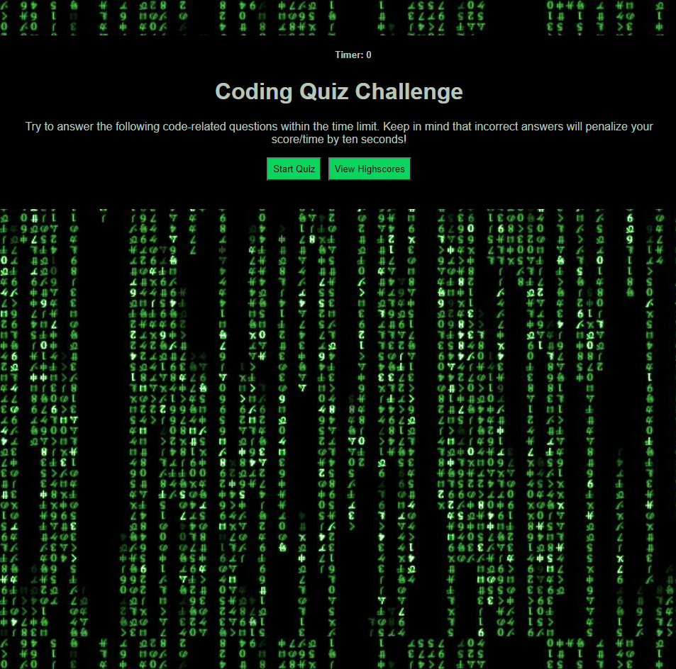

# Coding Quiz Challenge

This is a complete refactor of the previous application I created: "js-quiz-game" in order to make the code more dry and efficient.

This web application is designed as a responsive web game for the user to test their knowledge on coding. The user races against the timer, which subtracts ten seconds for every incorrect answer. The user's high scores are recorded so the user can gauge their progress and play against their own best record. The Highest Score is stored in client-side storage.

## Table of Contents
* [Getting Started](#getting-started)
* [Main Page](#main-page)
* [Built With](#built-with)
* [Deployment](#deployment)
* [Previous Version of Application](#previous-version-of-application)
* [Next Steps](#next-steps)
* [Author](#author)

## Getting Started
There are no special instructions to get a copy of this project up and running on your local machine. Simply click on the deployed application link or copy and paste the url into your search bar to open in the browser of your choice.

## Main Page

## Built With:
* Html
* CSS
* JavaScript

## Deployment
Deployed Application URL: https://jaymemizelle.github.io/coding-quiz-challenge/

## Previous Version of Application 
### JS Quiz Game
* js-quiz-game Repository Link: https://github.com/jaymemizelle/js-quiz-game
* js-quiz-game Deployed Application URL: https://jaymemizelle.github.io/js-quiz-game/

## Next Steps
Refactor code for readability by abstracting the functions built within the AJAX api calls. 

 ## Author
* Jayme Mizelle
